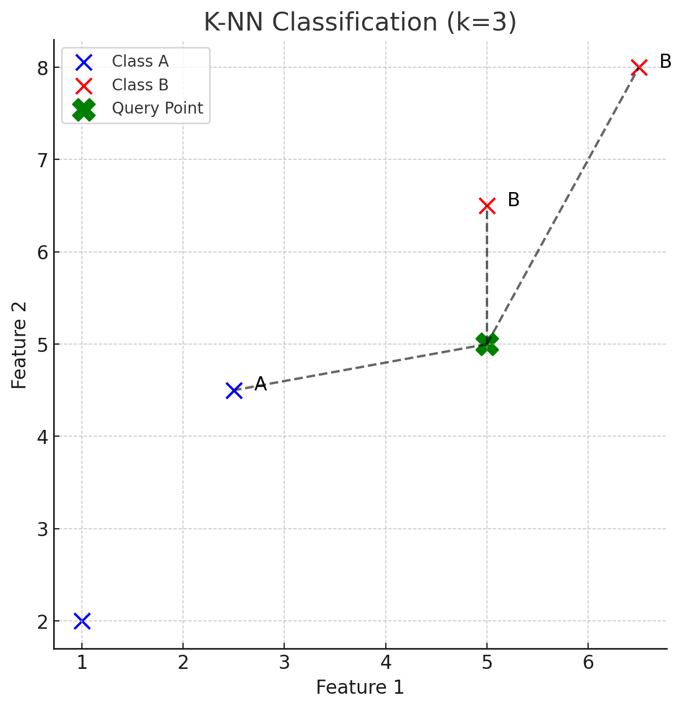

### **K-Nearest Neighbors (K-NN) Algorithm**
K-Nearest Neighbors (K-NN) is a simple, non-parametric, and lazy learning algorithm used for classification and regression. It classifies a data point based on the class of its nearest neighbors.

### **1. Mathematical Foundation of K-NN**
#### **1.1 Distance Metric**
K-NN is based on measuring the similarity between data points using a distance metric. The most commonly used distance metric is the **Euclidean Distance**, which is given by:

$$
d(p, q) = \sqrt{\sum_{i=1}^{n} (p_i - q_i)^2}
$$

where:
- $ p = (p_1, p_2, ..., p_n) $ and $ q = (q_1, q_2, ..., q_n) $ are two points in an $ n $-dimensional feature space.

Other distance metrics include:
- **Manhattan Distance**: $ d(p, q) = \sum_{i=1}^{n} |p_i - q_i| $
- **Minkowski Distance**: $ d(p, q) = \left( \sum_{i=1}^{n} |p_i - q_i|^p \right)^{\frac{1}{p}} $
- **Cosine Similarity**: $ \cos(\theta) = \frac{p \cdot q}{\|p\| \|q\|} $

#### **1.2 Classification in K-NN**
For a given test point $ x $, K-NN finds the **k** nearest training points based on the selected distance metric. The class label of $ x $ is determined using **majority voting**:

$$
\hat{y} = \arg\max_{c} \sum_{i=1}^{k} \mathbb{1}(y_i = c)
$$

where:
- $ y_i $ represents the class label of the $ i^{th} $ nearest neighbor.
- $ \mathbb{1}(y_i = c) $ is an indicator function that returns 1 if $ y_i = c $ and 0 otherwise.
- The predicted class $ \hat{y} $ is the most frequently occurring class among the k-nearest neighbors.

#### **1.3 Regression in K-NN**
In K-NN regression, the predicted value is computed as the mean (or weighted mean) of the target values of the k-nearest neighbors:

$$
\hat{y} = \frac{1}{k} \sum_{i=1}^{k} y_i
$$

Alternatively, a **distance-weighted regression** can be used:

$$
\hat{y} = \frac{\sum_{i=1}^{k} \frac{y_i}{d(x, x_i)}}{\sum_{i=1}^{k} \frac{1}{d(x, x_i)}}
$$

where $ d(x, x_i) $ is the distance between $ x $ and its $ i^{th} $ nearest neighbor.

### **2. Choosing the Best Value of $ k $**
- **Small $ k $**: Leads to a more complex model (low bias, high variance). Sensitive to noise.
- **Large $ k $**: Leads to a smoother decision boundary (high bias, low variance). Might ignore important local structures.
- **Optimal $ k $** is often found using cross-validation.

### **3. Advantages & Disadvantages of K-NN**
#### **Advantages**
- Simple and intuitive.
- Works well for small datasets.
- No training phase (lazy learning).

#### **Disadvantages**
- Computationally expensive for large datasets.
- Sensitive to irrelevant or unscaled features.
- Requires a proper choice of $ k $ for optimal performance.

---

## **Step-by-Step Process of K-NN**

### **Step 1: Load the Dataset**
Before K-NN can make predictions, it needs a dataset consisting of:
- **Feature variables (X)** – numerical or categorical attributes.
- **Target variable (Y)** – labels for classification or continuous values for regression.

🔹 **Example Dataset (Classification Problem)**
| Feature 1 | Feature 2 | Class |
|-----------|-----------|-------|
| 2.5       | 4.5       | A     |
| 1.0       | 2.0       | A     |
| 5.0       | 6.5       | B     |
| 6.5       | 8.0       | B     |

Each row represents a data point, and the last column represents its class label.

---

### **Step 2: Choose the Value of $ k $ **
- $ k $  represents the number of nearest neighbors considered for prediction.
- A **small $ k $ ** (e.g., $ k = 1 $ ) may lead to an unstable model (high variance).
- A **large $ k $ ** (e.g., $ k = 20 $ ) may result in oversmoothing (high bias).

🔹 A common approach is to test multiple $ k $  values and select the best one using **cross-validation**.

---

### **Step 3: Calculate the Distance Between the Query Point and All Other Points**
To classify a new point, K-NN calculates its distance to every existing data point in the dataset.

#### **Most Common Distance Metric: Euclidean Distance**
\[
d(A, B) = \sqrt{(x_2 - x_1)^2 + (y_2 - y_1)^2}
\]

Where:
- $ x_1, y_1 $  are the coordinates of the first point.
- $ x_2, y_2 $  are the coordinates of the second point.

🔹 **Example Visualization:**
Imagine plotting data points on a 2D graph where different classes (e.g., "A" and "B") are marked with different colors.

Let’s say we want to classify a **new point (5, 5)**:

| Feature 1 | Feature 2 | Class | Distance to (5,5) |
|-----------|-----------|-------|--------------------|
| 2.5       | 4.5       | A     | $ d = 2.55 $     |
| 1.0       | 2.0       | A     | $ d = 5.0 $      |
| 5.0       | 6.5       | B     | $ d = 1.5 $      |
| 6.5       | 8.0       | B     | $ d = 3.2 $      |

---

### **Step 4: Identify the k Nearest Neighbors**
- Assume $ k = 3 $ .
- The 3 closest points based on distance are selected.

🔹 **Example Neighbors for (5,5) when $ k = 3 $ :**
1. (5.0, 6.5) → Class **B**
2. (2.5, 4.5) → Class **A**
3. (6.5, 8.0) → Class **B**

---

### **Step 5: Predict the Class (Classification)**
- **Majority Voting**: The most common class among the **k** neighbors is chosen.
- **Example**: If 2 neighbors belong to **Class B** and 1 to **Class A**, the new point is classified as **B**.

🔹 **Voting Result for $ k = 3 $ **:
| Neighbor | Class |
|----------|-------|
| (5.0, 6.5) | B |
| (2.5, 4.5) | A |
| (6.5, 8.0) | B |
✅ **Predicted Class = B** (Majority vote)

---

### **Step 6: Predict the Value (Regression)**
For **regression**, instead of voting, the predicted value is the **mean (or weighted mean)** of the nearest neighbors’ values.

\[
\hat{y} = \frac{1}{k} \sum_{i=1}^{k} y_i
\]

If distance weighting is applied:

\[
\hat{y} = \frac{\sum_{i=1}^{k} \frac{y_i}{d_i}}{\sum_{i=1}^{k} \frac{1}{d_i}}
\]

🔹 **Example Regression Output:**
| Neighbor | Target Value |
|----------|-------------|
| (5.0, 6.5) | 7.2 |
| (2.5, 4.5) | 5.8 |
| (6.5, 8.0) | 8.1 |

📌 **Predicted Value (Simple Mean)**:
\[
\hat{y} = \frac{7.2 + 5.8 + 8.1}{3} = 7.03
\]

---

## **Key Takeaways**
✔ **Lazy Learning**: No explicit training phase; predictions happen at runtime.  
✔ **Instance-Based**: Stores all training data for reference.  
✔ **Highly Affected by Distance**: Performance depends on an appropriate distance metric.  
✔ **Choice of $ k $  Matters**: Small $ k $  is sensitive to noise; large $ k $  smoothens predictions.

